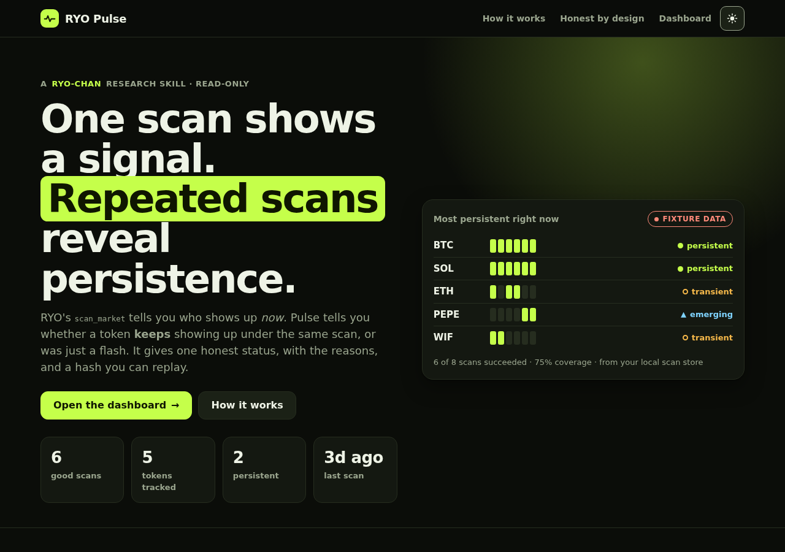
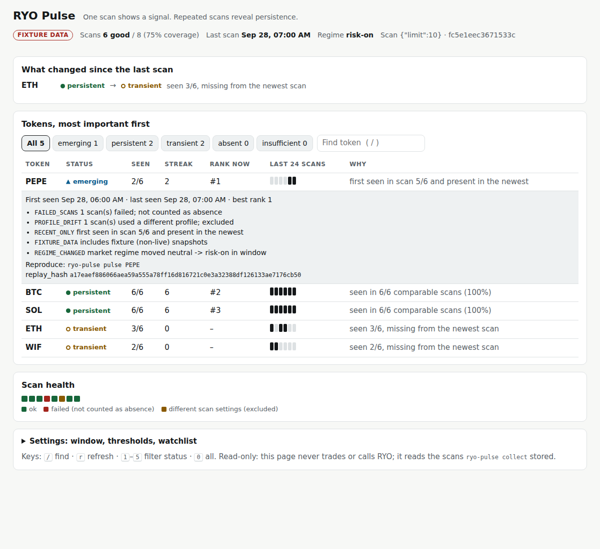

# RYO Pulse

**One scan shows a signal. Repeated scans reveal persistence.**

RYO Pulse is a **Track 3 (New Skills)** entry, with a separate **Track 2 (Dashboards & Interfaces)** half (see [Dashboard](#dashboard-track-2)), for the RYO-CHAN Hackathon 2026. It is a read-only research skill: given a token and a window of **comparable** `scan_market` snapshots (same scan profile), it returns one status:

| Status | Meaning |
|---|---|
| `persistent` | Keeps showing up across the window |
| `emerging` | Showing up now, only recently. A real signal, not yet a pattern |
| `transient` | Showed up, but faded or only sporadically |
| `absent` | Enough good scans, and it never showed up |
| `insufficient` | Not enough comparable, successful scans to say anything honest |

It also returns counts, coverage, first/last seen, best rank, current streak, machine-readable reasons and a stable `replay_hash`. There is no trading, no thesis and no LLM "quality" judgement.

## The gap it fills

RYO's `scan_market` answers *"who shows up **now**?"*. Agents tend to treat one hit as a lasting signal. RYO has no primitive that asks *"did this token keep showing up under the same scan, or was it a flash?"* Pulse is that primitive: a small, deterministic skill contract that sits next to the existing tools.

Honesty rules built into the engine:
- **Outages are not absence.** A failed scan is stored as `ok=false` and lowers coverage. It is never read as "the token wasn't there".
- **Only like is compared with like.** Scans with a different profile (chain, theme, top_n, ...) are *drifted* and excluded, so one profile hash means one comparable series.
- **One appearance is still a signal.** It becomes `emerging` or `transient`, never "noise".
- **Fixture data is labelled.** Any non-live snapshot sets `provenance` to `fixture` or `mixed` and adds a `FIXTURE_DATA` reason.

## Quick start

```bash
python -m venv .venv && source .venv/bin/activate   # Windows: .venv\Scripts\activate
pip install -e ".[dev]"
pytest                                               # all tests run offline

# Offline demo on the labelled synthetic fixture
ryo-pulse board --fixture tests/fixtures/demo_window.json
ryo-pulse pulse PEPE --fixture tests/fixtures/demo_window.json
```

### Live RYO data

```bash
cp .env.example .env        # fill RYO_MCP_URL and RYO_MCP_KEY (never commit .env)
ryo-pulse discover -p top_n=20
#   -> lists RYO tools, saves real scan_market / market_overview samples to data/catalog/,
#      prints candidate field paths. Confirm one, then set RYO_SCAN_TOKENS_PATH
#      (and optionally RYO_OVERVIEW_REGIME_PATH) in .env.
ryo-pulse collect -p top_n=20 --every 30        # one comparable snapshot every 30 min; Ctrl+C to stop
ryo-pulse profiles
ryo-pulse board
ryo-pulse pulse BTC --save results/btc.json
ryo-pulse replay results/btc.json               # recomputes and checks the replay_hash
```

The adapter reads **only field paths you confirmed from a real response**. Nothing about `scan_market`'s output shape is guessed in code.

## Dashboard (Track 2)

```bash
ryo-pulse serve                      # opens http://127.0.0.1:8765 (landing) → /board (dashboard)
ryo-pulse serve --fixture tests/fixtures/demo_window.json   # offline demo (labelled FIXTURE DATA)
```





A local, read-only screen for **configuring and monitoring** the Pulse skill. It answers "what changed and why" at a glance:

- **What changed since the last scan** comes first: status transitions (for example `persistent → transient`) with the reason, plus the tokens that entered or dropped out of the newest scan.
- **Tokens, most important first:** emerging, then persistent, transient and absent. Each row has hits, streak, current rank, a presence strip of the last 24 good scans and a plain-language *why*. Expand a row for every reason, a `ryo-pulse pulse` command to reproduce it and the `replay_hash`.
- **Scan health:** ok, failed and drifted scans over time, plus a banner when the latest scan failed. Failures are never shown as absence.
- **Settings:** window size, the four thresholds and a watchlist pinned to the top. These are saved per browser, sent to the same engine the skill uses, and the page refreshes every 60 s.
- **Landing page** at `/` with live stats from your scan store and a "most persistent right now" card. The dashboard is at `/board`.
- **Look:** a dark site with the accent colour `#c5ff4a`. The landing page alternates dark and light bands as you scroll.
- **Works for everyone:** keyboard-only use (`/` find, `r` refresh, `1`–`5` status filters, Tab and Enter on rows), status shown by text and shape and not by colour alone, a skip link, live-region updates, and phone width (tokens become cards on a phone).

It never calls RYO and has no new dependencies (Python stdlib server + plain HTML/CSS/JS, no build step, no external assets). Every number on screen comes from `engine.classify`, so the skill (Track 3) and the interface (Track 2) can each be judged on their own.

## How it works

```
scan_market ──► collector ──► snapshot store (append-only JSON + raw response)
market_overview ─┘ (regime context)          │
                                             ▼
                      PulseRequest(token, snapshots, thresholds)
                                             │
                                  engine.classify  (pure, deterministic)
                                             ▼
                      PulseResult(status, counts, coverage, reasons, replay_hash)
```

Classification rules, in order (the defaults can be changed with CLI flags):
1. Keep successful snapshots whose profile hash matches the judged profile (*valid*).
2. `valid < 3` or `coverage < 60%` → `insufficient`
3. No hits → `absent`
4. `hits ≥ 3` and `hits/valid ≥ 60%` → `persistent`
5. In the newest valid scan and first seen in the newer half of the window → `emerging`
6. Otherwise → `transient` (`FADED` or `SPORADIC`)

See [docs/design.md](docs/design.md) for the full contract and [docs/schema/](docs/schema/) for the JSON Schemas and the MCP-style tool definition (`scan_persistence`).

### Coping with failure
- The MCP client retries 408/425/429/5xx and network errors with exponential backoff, and honours `Retry-After`.
- A scan that still fails is **recorded** as a failed snapshot, so coverage reflects it and the collector keeps running.
- The store is append-only with atomic writes, so a restart loses at most the scan in flight and the series resumes.
- `market_overview` context is optional. If it fails, the scan still counts.

### Combining sources
Each snapshot pairs `scan_market` presence with `market_overview` regime context. Results report the regime at the start and end of the window and flag `REGIME_CHANGED` when persistence spans a regime shift.

## Project layout

```
src/ryo_pulse/
  models.py     skill contract (PulseRequest / PulseResult / Snapshot / 5 statuses)
  profile.py    profile hash: only comparable scans share one
  engine.py     deterministic classifier
  canonical.py  canonical JSON + sha256 (replay_hash)
  store.py      append-only local snapshot store
  client.py     minimal MCP (streamable HTTP, JSON-RPC) client with retries
  paths.py      confirmed-field-path extractor for the adapter
  collector.py  live scan_market (+ market_overview) → Snapshot
  skill.py      JSON-in/JSON-out entry + tool definition
  cli.py        rich CLI
  dashboard.py  Track 2: board builder + local read-only HTTP server
  web/          landing.html, board.html, shared theme.css (no build step, no external assets)
tests/          offline tests; fixtures/ are SYNTHETIC and labelled as such
docs/           design + JSON schemas
```

## Disclosure (hackathon rules)

- Written during the event window (Aug 18 – Oct 3, 2026 JST). No starter template was used.
- Third-party libraries: [pydantic](https://docs.pydantic.dev/), [httpx](https://www.python-httpx.org/), [rich](https://github.com/Textualize/rich), [pytest](https://pytest.org/).
- AI assistance: built with Claude Code.
- `tests/fixtures/demo_window.json` is **synthetic** test data, and is labelled so in the file and in every result it produces. Live demos use snapshots collected from RYO with `ryo-pulse collect`.
- No secrets are committed. Use `.env.example` and keep your real `.env` local.
