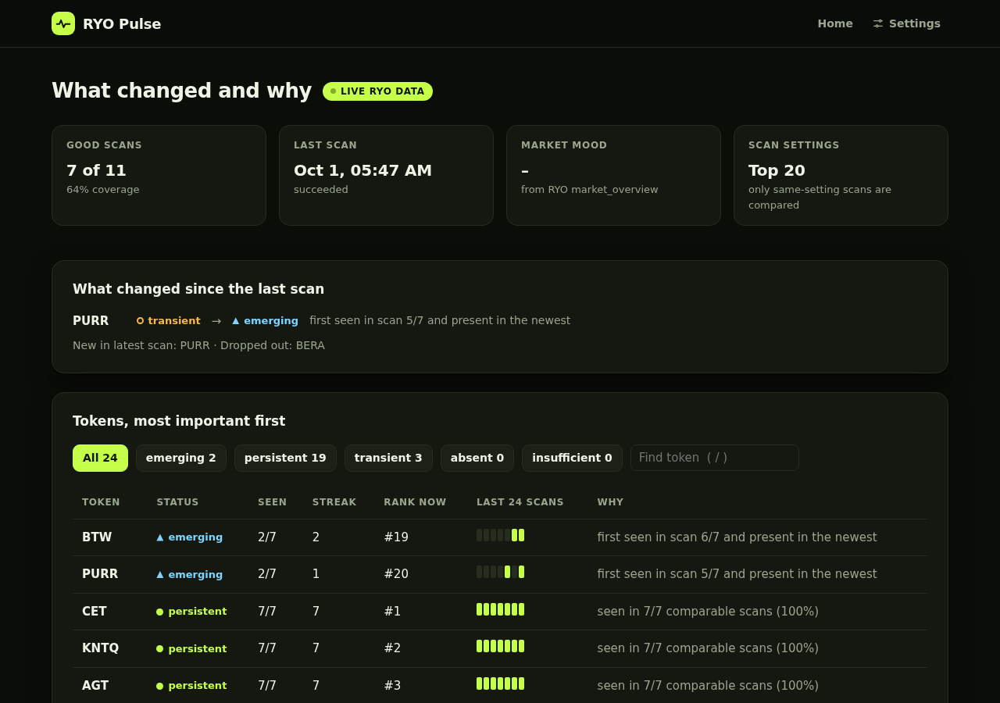

# RYO Pulse

**One scan shows a signal. Repeated scans reveal persistence.**

RYO Pulse is a **Track 3 (New Skills)** entry, with a separate **Track 2 (Dashboards & Interfaces)** half (see [Dashboard](#dashboard-track-2)), for the RYO-CHAN Hackathon 2026. It is a read-only research skill: given a token and a window of **comparable** `scan_market` snapshots (same scan profile), it returns one status:

| Status | Meaning |
|---|---|
| `persistent` | Keeps showing up across the window |
| `emerging` | Showing up now, only recently. A real signal, not yet a pattern |
| `transient` | Showed up, but faded or only sporadically |
| `absent` | Enough good scans, and it never showed up |
| `insufficient` | Not enough comparable, successful scans to say anything honest |

It also returns counts, coverage, first/last seen, best rank, current streak, machine-readable reasons and a stable `replay_hash`. There is no trading, no thesis and no LLM "quality" judgement.

## The gap it fills

RYO's `scan_market` answers *"who shows up **now**?"*. Agents tend to treat one hit as a lasting signal. RYO has no primitive that asks *"did this token keep showing up under the same scan, or was it a flash?"* Pulse is that primitive: a small, deterministic skill contract that sits next to the existing tools.

**How an agent uses it.** Before acting on a `scan_market` hit, call `scan_persistence` for that token. *Persistent* means it has kept showing up under the same scan. *Emerging* means it is new and worth watching, not yet a pattern. *Transient* means it was a flash. *Insufficient* means RYO's data was too patchy to say, so the agent should wait instead of guessing. The answer comes with plain reasons and a `replay_hash` the agent (or a human) can re-check later.

Honesty rules built into the engine:
- **Outages are not absence.** A failed scan is stored as `ok=false` and lowers coverage. It is never read as "the token wasn't there".
- **Only like is compared with like.** Scans with a different profile (chain, theme, top_n, ...) are *drifted* and excluded, so one profile hash means one comparable series.
- **One appearance is still a signal.** It becomes `emerging` or `transient`, never "noise".
- **Fixture data is labelled.** Any non-live snapshot sets `provenance` to `fixture` or `mixed` and adds a `FIXTURE_DATA` reason.

## Quick start

### Mac / Linux

```bash
python -m venv .venv && source .venv/bin/activate
pip install -e ".[dev]"
pytest                                               # all tests run offline

# Offline demo on the labelled synthetic fixture
ryo-pulse board --fixture tests/fixtures/demo_window.json
ryo-pulse pulse PEPE --fixture tests/fixtures/demo_window.json
```

### Windows (PowerShell)

```powershell
git clone https://github.com/Mhiah/RYO-PULSE.git
cd RYO-PULSE
python -m venv .venv
.venv\Scripts\activate
pip install -e ".[dev]"
pytest

# Offline demo on the labelled synthetic fixture
ryo-pulse serve --fixture tests/fixtures/demo_window.json

# Live RYO data
if (-not (Test-Path .env)) { Copy-Item .env.example .env }
notepad .env        # fill RYO_MCP_URL and RYO_MCP_KEY
ryo-pulse collect -p top_n=20 --every 30
ryo-pulse serve --lan
```

If `pip install` says a file is in use, a running `ryo-pulse collect` is holding it; the existing install still works. If `ryo-pulse` isn't found, run `$env:PYTHONPATH="src"; python -m ryo_pulse serve` from the repo folder.

### Live RYO data (Mac / Linux)

```bash
cp -n .env.example .env     # creates .env only if missing; fill RYO_MCP_URL and RYO_MCP_KEY (never commit .env)
ryo-pulse discover -p top_n=20
#   -> lists RYO tools, saves real scan_market / market_overview samples to data/catalog/,
#      prints candidate field paths. Confirm one, then set RYO_SCAN_TOKENS_PATH
#      (and optionally RYO_OVERVIEW_REGIME_PATH) in .env.
ryo-pulse collect -p top_n=20 --every 30        # one comparable snapshot every 30 min; Ctrl+C to stop
ryo-pulse profiles
ryo-pulse board
ryo-pulse pulse BTC --save results/btc.json
ryo-pulse replay results/btc.json               # recomputes and checks the replay_hash
```

The adapter reads **only field paths you confirmed from a real response**. Nothing about `scan_market`'s output shape is guessed in code.

### Settings (`.env`)

| Variable | Required | What it does |
|---|---|---|
| `RYO_MCP_URL` | yes | RYO MCP endpoint, `https://app-ryochan.com/api/mcp` |
| `RYO_MCP_KEY` | yes | Your RYO key. Never commit it |
| `RYO_AUTH_HEADER` / `RYO_AUTH_SCHEME` | no | How the key is sent. Default `Authorization: Bearer <key>` |
| `RYO_SCAN_TOKENS_PATH` | yes | Where tokens sit in a `scan_market` response. Confirmed live: `data.candidates[].symbol` |
| `RYO_SCAN_STATUS_PATH` | no | Where RYO reports scan health. Default `status` |
| `RYO_SCAN_FAIL_STATUSES` | no | Statuses stored as failed scans, not absence. Default `unavailable,error,failed` |
| `RYO_OVERVIEW_REGIME_PATH` | no | Where `market_overview` puts the regime label. Fills the "Market mood" tile |
| `PULSE_DATA_DIR` | no | Local snapshot store. Default `data/snapshots` |
| `TAVILY_API_KEY`, `OPENROUTER_API_KEY` | no | Not used by the core skill |

## Example: one real call

From live RYO scans on Oct 1 2026 (`scan_market`, top 20, 11 scans of which 4 failed during a RYO outage). Input, abbreviated:

```json
{"token": "BTW", "snapshots": [/* 11 stored scan_market snapshots */], "thresholds": {"min_valid": 3, "min_coverage": 0.6, "persistent_ratio": 0.6, "persistent_min_hits": 3}}
```

Output, abbreviated (`ryo-pulse pulse BTW --json` prints it in full):

```json
{
  "token": "BTW",
  "status": "emerging",
  "counts": {"total": 11, "valid": 7, "failed": 4, "drifted": 0, "hits": 2},
  "coverage": 0.6364,
  "hit_ratio": 0.2857,
  "current_streak": 2,
  "first_seen": "2026-10-01T05:17:57Z",
  "last_seen": "2026-10-01T05:47:58Z",
  "best_rank": 16,
  "provenance": "live",
  "reasons": [
    {"code": "FAILED_SCANS", "detail": "4 scan(s) failed; not counted as absence"},
    {"code": "RECENT_ONLY", "detail": "first seen in scan 6/7 and present in the newest"}
  ],
  "replay_hash": "92104d6f81e5c77bc345f5bcd4d56555cbb2d11257833b4b5dac0f9e8db37f19"
}
```

The four failed scans lower coverage but are not read as "BTW wasn't there". `ryo-pulse replay` recomputes the same `replay_hash` from the stored scans.

## Dashboard (Track 2)

```bash
ryo-pulse serve                      # opens http://127.0.0.1:8765 (landing) → /board (dashboard)
ryo-pulse serve --fixture tests/fixtures/demo_window.json   # offline demo (labelled FIXTURE DATA)
ryo-pulse serve --lan                # also open it from a phone on the same Wi-Fi (prints the address)
```

On Windows, if `ryo-pulse` isn't found, run it from the repo folder with `$env:PYTHONPATH="src"; python -m ryo_pulse serve`. The server reads the page files when it starts, so restart it after pulling changes.




A local, read-only screen for **configuring and monitoring** the Pulse skill. Its headline is the question it answers: **What changed and why**.

- **At a glance:** four tiles for good scans and coverage, the last scan, RYO's market mood and the scan settings in plain words (for example "Top 20"), plus a LIVE or FIXTURE DATA badge.
- **What changed since the last scan** comes next: status transitions (for example `persistent → transient`) with the reason, plus the tokens that entered or dropped out of the newest scan.
- **Tokens, most important first:** emerging, then persistent, transient and absent. Each row has hits, streak, current rank, a presence strip of the last 24 good scans and a plain-language *why*. Expand a row for every reason, a `ryo-pulse pulse` command to reproduce it and the `replay_hash`.
- **Scan health:** ok, failed and drifted scans over time, plus a banner when the latest scan failed. Failures are never shown as absence.
- **Settings:** a Settings button in the top bar (or `s`) opens a popup for window size, the four thresholds and a watchlist pinned to the top. Empty boxes show the values in use. Settings are saved per browser and sent to the same engine the skill uses. The page refreshes every 60 s.
- **Landing page** at `/`: the idea in one screen, a "most persistent right now" card and live stats from your scan store, then how it works and why it won't invent absence. The dashboard is at `/board`.
- **Look:** a dark site with the accent colour `#c5ff4a` and a bundled font, so it looks the same on Windows, Mac and phones. The landing page alternates dark and light bands as you scroll.
- **Works for everyone:** keyboard-only use (`/` find, `r` refresh, `s` settings, `1`–`5` status filters, Tab and Enter on rows), status shown by text and shape and not by colour alone, a skip link, live-region updates, and phone width (tokens become cards on a phone).

It never calls RYO and has no new dependencies (Python stdlib server + plain HTML/CSS/JS, no build step, no external assets). Every number on screen comes from `engine.classify`, so the skill (Track 3) and the interface (Track 2) can each be judged on their own.

## How it works

```
scan_market ──► collector ──► snapshot store (append-only JSON + raw response)
market_overview ─┘ (regime context)          │
                                             ▼
                      PulseRequest(token, snapshots, thresholds)
                                             │
                                  engine.classify  (pure, deterministic)
                                             ▼
                      PulseResult(status, counts, coverage, reasons, replay_hash)
```

Classification rules, in order (the defaults can be changed with CLI flags):
1. Keep successful snapshots whose profile hash matches the judged profile (*valid*).
2. `valid < 3` or `coverage < 60%` → `insufficient`
3. No hits → `absent`
4. `hits ≥ 3` and `hits/valid ≥ 60%` → `persistent`
5. In the newest valid scan and first seen in the newer half of the window → `emerging`
6. Otherwise → `transient` (`FADED` or `SPORADIC`)

See [docs/design.md](docs/design.md) for the full contract and [docs/schema/](docs/schema/) for the JSON Schemas and the MCP-style tool definition (`scan_persistence`).

### Coping with failure
- The MCP client retries 408/425/429/5xx and network errors with exponential backoff, and honours `Retry-After`.
- A scan that still fails is **recorded** as a failed snapshot, so coverage reflects it and the collector keeps running.
- The store is append-only with atomic writes, so a restart loses at most the scan in flight and the series resumes.
- `market_overview` context is optional. If it fails, the scan still counts.

### Combining sources
Each snapshot pairs `scan_market` presence with `market_overview` regime context. Results report the regime at the start and end of the window and flag `REGIME_CHANGED` when persistence spans a regime shift.

## Project layout

```
src/ryo_pulse/
  models.py     skill contract (PulseRequest / PulseResult / Snapshot / 5 statuses)
  profile.py    profile hash: only comparable scans share one
  engine.py     deterministic classifier
  canonical.py  canonical JSON + sha256 (replay_hash)
  store.py      append-only local snapshot store
  client.py     minimal MCP (streamable HTTP, JSON-RPC) client with retries
  paths.py      confirmed-field-path extractor for the adapter
  collector.py  live scan_market (+ market_overview) → Snapshot
  skill.py      JSON-in/JSON-out entry + tool definition
  cli.py        rich CLI
  dashboard.py  Track 2: board builder + local read-only HTTP server
  web/          landing.html, board.html, shared theme.css, fonts/ (bundled DejaVu Sans; no build step, no external assets)
tests/          offline tests; fixtures/ are SYNTHETIC and labelled as such
docs/           design + JSON schemas
```

## Demo video

Link: *added at submission.* The script is in [DEMO.md](DEMO.md).

## Limitations

- Runs locally. The dashboard reads the snapshot store on the machine running `ryo-pulse collect`; there is no hosted version.
- Pulse needs history: it says *insufficient* until there are at least 3 good comparable scans and 60% coverage. Collect for a few hours before judging persistence.
- The "Market mood" tile stays blank until `RYO_OVERVIEW_REGIME_PATH` is set from a real `market_overview` response.
- The tool definition (`scan_persistence`) follows the MCP tool shape; it will be aligned with RYO's official skill spec once published.

## Disclosure (hackathon rules)

- Written during the event window (Aug 18 – Oct 3, 2026 JST). No starter template was used.
- Third-party libraries: [pydantic](https://docs.pydantic.dev/), [httpx](https://www.python-httpx.org/), [rich](https://github.com/Textualize/rich), [pytest](https://pytest.org/).
- Bundled font: [DejaVu Sans](https://dejavu-fonts.github.io/) (Bitstream Vera license, see `src/ryo_pulse/web/fonts/LICENSE.txt`), subset to Latin so the site looks the same on every OS.
- `tests/fixtures/demo_window.json` is **synthetic** test data, and is labelled so in the file and in every result it produces. Live demos use snapshots collected from RYO with `ryo-pulse collect`.
- No secrets are committed. Use `.env.example` and keep your real `.env` local.
